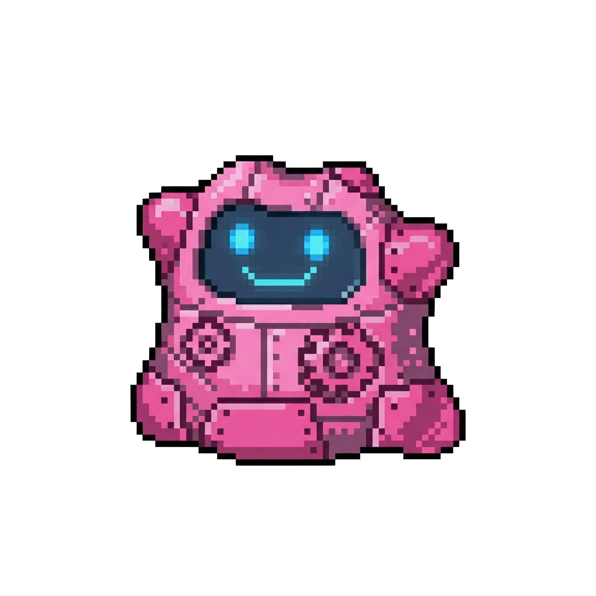
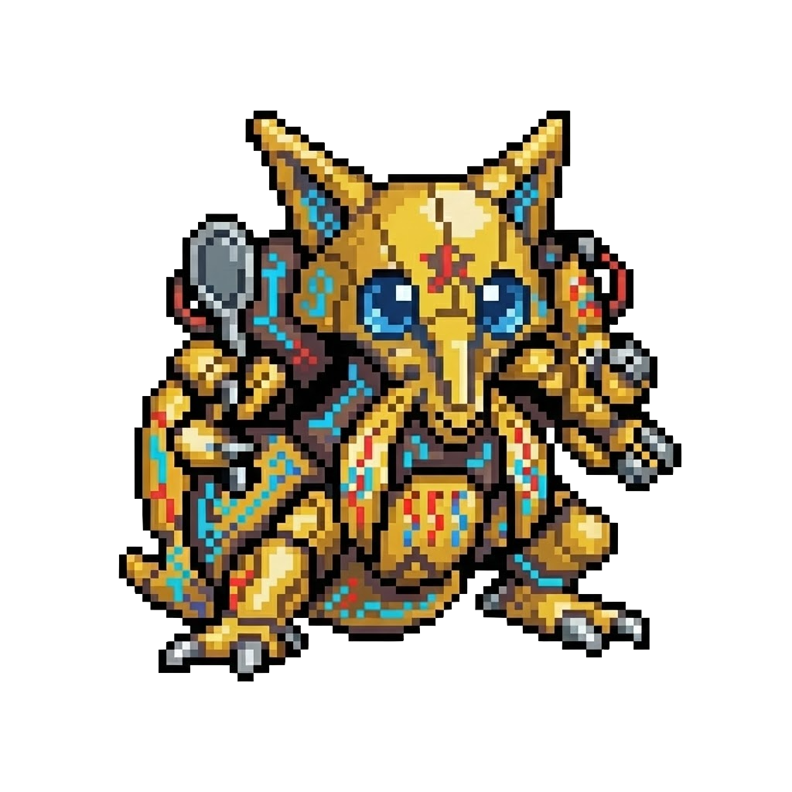
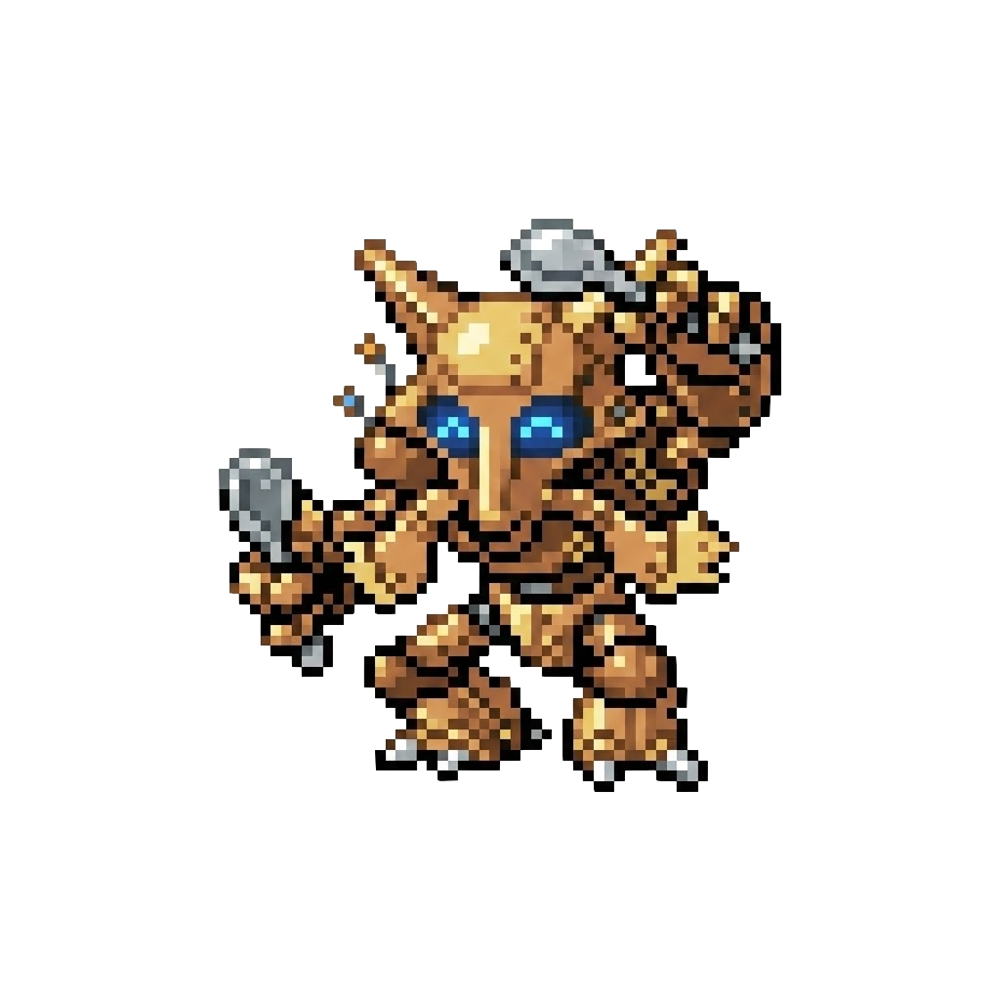
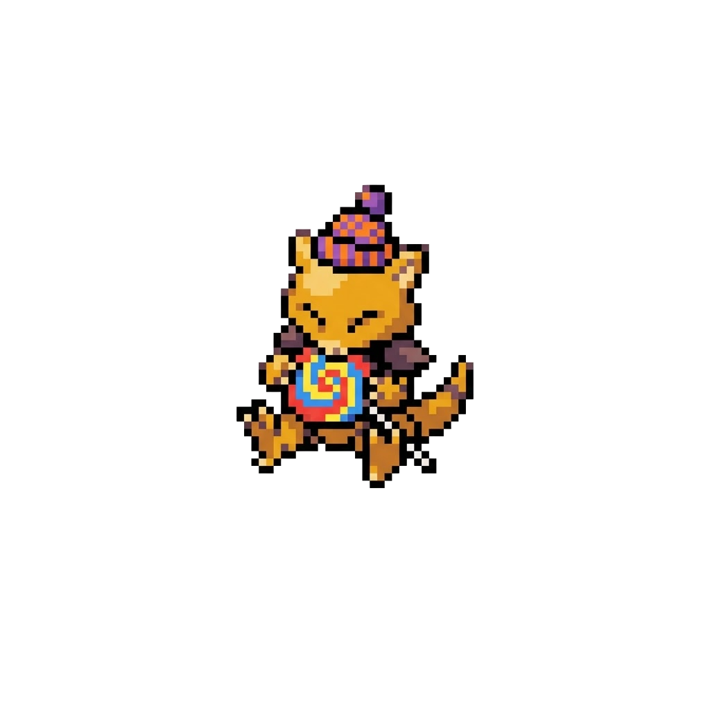

<div align="center">
    
</div>

<br>

<div align="center">
    
</div>

<br>

<div align="center">

[](https://arxiv.org/abs/2504.04395)
[](https://metamon.tech)
[](https://discord.gg/9zuJqgDpGg)

</div>


<br>

**Metamon** enables reinforcement learning (RL) research on [Pokémon Showdown](https://pokemonshowdown.com/) by providing:
 
1) 20+ pretrained policies ranging from ~average to expert-level human play.
2) A dataset of >4M (and counting) trajectories "reconstructed" from real human battles.
3) A dataset of >20M (and counting) trajectories generated by self-play between agents.
3) Starting points for training (or finetuning) your own imitation learning (IL) and RL policies.
5) A standardized suite of teams and heuristic opponents for evaluation.

Metamon is the codebase behind ["Human-Level Competitive Pokémon via Scalable Offline RL and Transformers"](https://arxiv.org/abs/2504.04395) (RLC, 2025). Please check out our [project website](https://metamon.tech) for an overview of our original results. After the release of our conference paper, metamon served as a starter kit and winning baseline for the [NeurIPS 2025 PokéAgent Challenge](https://pokeagent.github.io), which motivated significant improvements to our results and datasets.


<br>

<div align="center">
    
</div>

<br>

#### Supported Rulesets

Pokémon Showdown hosts many different rulesets spanning nine generations of the video game franchise. Metamon initially focused on the most popular singles ruleset ("OverUsed") for **Generations 1, 2, 3, and 4** but has recently expanded to include **Generation 9 OverUsed** (OU). We also support the UnderUsed (UU), NeverUsed (NU), and Ubers tiers for Generations 1, 2, 3, and 4 – though constant rule changes and small dataset sizes have always made these a bit of an afterthought.

<br>


### Table of Contents

1. [**Installation**](#installation)

2. [**Quick Start**](#quick-start)

3. [**Pretrained Models**](#pretrained-models)

4. [**Battle Datasets**](#battle-datasets)

5. [**Team Sets**](#team-sets)

6. [**Baselines**](#baselines)

7. [**Observation Spaces, Action Spaces, & Reward Functions**](#observation-spaces-action-spaces--reward-functions)

8. [**Training and Evaluation**](#training-and-evaluation)

9. [**Other Datasets**](#other-datasets)

10. [**Battle Backends**](#battle-backends)

11. [**FAQ**](#faq)

12. [**Acknowledgement**](#acknowledgements)

13. [**Citation**](#citation)


<br>
 
---

<br>

<details>
<summary><h2>Installation</h2></summary>

Metamon is written and tested for linux and python 3.10+. We recommend creating a fresh virtual environment or [conda](https://docs.anaconda.com/anaconda/install/) environment:

```shell
conda create -n metamon python==3.10
conda activate metamon
```

Then, install with:

```shell
git clone --recursive git@github.com:UT-Austin-RPL/metamon.git
cd metamon
pip install -e .
```

To install [Pokémon Showdown](https://pokemonshowdown.com/), we'll need a modern version of `npm` / Node.js (instructions [here](https://nodejs.org/en/download/package-manager)). Note that Showdown undergoes constant updates... breaking changes are rare, but do happen. The version that downloads with this repo (`metamon/server`) is always supported.

```shell
cd server/pokemon-showdown
npm install
```

We will need to have the Showdown server running in the background while using Metamon:
```shell
# in the background (`screen`, etc.)
node pokemon-showdown start --no-security
# no-security removes battle speed throttling and password requirements on your local server
```

If necessary, we can customize the server settings (`config/config.js`) or [the rules for each game mode](https://github.com/smogon/pokemon-showdown/blob/master/config/CUSTOM-RULES.md).

Verify that installation has gone smoothly with:
```bash
# run a few test battles on the local server
python -m metamon.env
```

Metamon provides large datasets of Pokémon team files, human battles, and other statistics that will automatically download when requested. Specify a path with:
```bash
# add to ~/.bashrc
export METAMON_CACHE_DIR=/path/to/plenty/of/disk/space
```

</details>

<br>

____

<br>

## Quick Start

Metamon makes it easy to turn Pokémon into an RL research problem. Pick a set of Pokémon teams to play with, an observation space, an action space, and a reward function:

```python
from metamon.env import get_metamon_teams
from metamon.interface import DefaultObservationSpace, DefaultShapedReward, DefaultActionSpace

team_set = get_metamon_teams("gen1ou", "competitive")
obs_space = DefaultObservationSpace()
reward_fn = DefaultShapedReward()
action_space = DefaultActionSpace()
```

Then, battle against built-in baselines (or any [`poke_env.Player`](https://github.com/hsahovic/poke-env)):

```python 
from metamon.env import BattleAgainstBaseline
from metamon.baselines import get_baseline

env = BattleAgainstBaseline(
    battle_format="gen1ou",
    observation_space=obs_space,
    action_space=action_space,
    reward_function=reward_fn,
    team_set=team_set,
    opponent_type=get_baseline("Gen1BossAI"),
)

# standard `gymnasium` environment
obs, info = env.reset()
next_obs, reward, terminated, truncated, info = env.step(env.action_space.sample())
```

The more flexible option is to request battles on our local Showdown server and battle anyone else who is online (humans, pretrained agents, or other Pokémon AI projects). If it plays Showdown, we can battle against it!

```python
from metamon.env import QueueOnLocalLadder

env = QueueOnLocalLadder(
    battle_format="gen1ou",
    player_username="my_scary_username",
    num_battles=10,
    observation_space=obs_space,
    action_space=action_space,
    reward_function=reward_fn,
    player_team_set=team_set,
)
```

Metamon's main feature is that it creates a dataset of "reconstructed" human demonstrations for these environments:

```python
from metamon.data import ParsedReplayDataset
# pytorch dataset. examples are converted to 
# the chosen obs/actions/rewards on-the-fly.
offline_dset = ParsedReplayDataset(
    observation_space=obs_space,
    action_space=action_space,
    reward_function=reward_func,
    formats=["gen1ou"],
)
obs_seq, action_seq, reward_seq, done_seq = offline_dset[0]
```

We can save our own agents' experience in the same format:

```python
env = QueueOnLocalLadder(
    .., # rest of args
    save_trajectories_to="my_data_path",
)
online_dset = ParsedReplayDataset(
    dset_root="my_data_path",
    observation_space=obs_space,
    action_space=action_space,
    reward_function=reward_func,
)
terminated = False
while not terminated:
    *_, terminated, _, _ = env.step(env.action_space.sample())
# find completed battles before loading examples
online_dset.refresh_files()
```

You are free to use this data to train an agent however you'd like, but we provide starting points for smaller-scale IL (`python -m metamon.il.train`) and RL (`python -m metamon.rl.train`), and a large set of pretrained models from our paper.

<br>

____

<br>


## Pretrained Models

We have made every checkpoint of 29 models available on huggingface at [`jakegrigsby/metamon`](https://huggingface.co/jakegrigsby/metamon/tree/main). You will need to install [`amago`](https://github.com/UT-Austin-RPL/amago), which is an RL codebase by the same authors. Follow instructions [here](https://ut-austin-rpl.github.io/amago/installation.html).


<div align="center">
    
</div>

<br>

Load and run pretrained models with `metamon.rl.evaluate`. For example:

```bash
python -m metamon.rl.evaluate --eval_type heuristic --agent Kakuna --gens 1 --formats ou --total_battles 100
```

Will run the default checkpoint of the best model for 100 battles against a set of heuristic baselines highlighted in the paper.

Or to battle against whatever is logged onto the local Showdown server (including other pretrained models that are already waiting):

```bash
python -m metamon.rl.evaluate --eval_type ladder --agent Kakuna --gens 1 --formats ou --total_battles 50 --username <pick unique username> --team_set competitive
```

<br>


### Featured Policies

There are now **29 official metamon models**. Most of them were stepping stones to later (better) versions, and are now mainly useful as baselines or extra opponents in self-play data collection. Some notable exceptions worth knowing about are:

<table>
<tr>
  <th align="center">Model</th><th align="center">Size</th><th align="center">Date</th><th align="center">Description</th>
  <th colspan="5" align="center">Human Ladder Ratings (GXE)</th>
</tr>
<tr>
  <th align="center"></th><th align="center"></th><th align="center"></th><th align="center"></th>
  <th align="center">G1</th><th align="center">G2</th><th align="center">G3</th><th align="center">G4</th><th align="center">G9</th>
</tr>
<tr>
  <td align="center"><br><b>SyntheticRLV2</b></td>
  <td align="center">200M</td>
  <td align="center">Sep 2024</td>
  <td>Original paper's best policy. Remains the basis of several successful third-party efforts to specialize in Gen1. <b>Most previous models have complete human ratings (see  below)</b>, but we have become a lot more cautious about laddering.</td>
  <td align="center">77%</td><td align="center">68%</td><td align="center">64%</td><td align="center">66%</td><td align="center">–</td>
</tr>
<tr>
  <td align="center"><br><b>Abra</b></td>
  <td align="center">57M</td>
  <td align="center">Jul 2025</td>
  <td>The best <i>gen9ou</i> agent that was open-sourced during the , and therefore the basis of many of the best third-party metamon extensions.</td>
  <td align="center">–</td><td align="center">–</td><td align="center">–</td><td align="center">–</td><td align="center">50%</td>
</tr>
<tr>
  <td align="center"><br><b>Kadabra3</b></td>
  <td align="center">57M</td>
  <td align="center">Sep 2025</td>
  <td>The best policy trained in time to participate in the  (as an organizer baseline). #1 in the Gen1OU qualifier and #2 in Gen9OU behind <a href="https://github.com/pmariglia/foul-play">foul-play</a>.</td>
  <td align="center">80%</td><td align="center">–</td><td align="center">–</td><td align="center">–</td><td align="center">64%</td>
</tr>
<tr>
  <td align="center"><br><b>Alakazam</b></td>
  <td align="center">57M</td>
  <td align="center">Sep 2025</td>
  <td>The final version of the  effort. Patched a bug that made tera types invisible to the policy, which makes it the best candidate for future work at this model size.</td>
  <td align="center">–</td><td align="center">–</td><td align="center">–</td><td align="center">–</td><td align="center">–</td>
</tr>
<tr>
  <td align="center"><br><b>Kakuna</b></td>
  <td align="center">142M</td>
  <td align="center">Dec 2025</td>
  <td><b>The best public metamon model</b> – leading by nearly every metric. Trained on diverse teams to serve as a strong foundation for further research in any gen. Appears on all 5 OU leaderboards and is consistently 1500+ Elo in Gen1OU.</td>
  <td align="center">82%</td><td align="center">70%</td><td align="center">63%</td><td align="center">64%</td><td align="center">71%</td>
</tr>
</table>


Models can be loosely divided into two eras of active development:

1. **RLC Paper** (Jan 2024 – Feb 2025): Trained on Gen 1-4 with old versions of the replay dataset and team sets.
2. **NeurIPS PokéAgent Challenge** (July – November 2025): Basically restarted from scratch. Broadly speaking, we *reduced* model sizes, reward shaping, and the paper's emphasis on long-term memory while *improving* generalization over diverse team choices and prioritizing support for gen9ou. However, it took several iterations to recover the paper's Gen 1-4 performance.


<br>

<details>
<summary><h3>Paper Policies</h3></summary>

*Paper policies play Gens 1-4 and are discussed in detail in the RLC 2025 paper. Some model sizes have several variants testing different RL objectives. See `metamon/rl/pretrained.py` for a complete list.*

<table>
  <tr>
    <th width="70" align="center"></th>
    <th align="center">Model Name (<code>--agent</code>)</th>
    <th align="center">Description</th>
  </tr>
  <tr><td></td><td><strong><code>SmallIL</code></strong> (2 variants)</td><td>15M imitation learning model trained on 1M human battles</td></tr>
  <tr><td></td><td><strong><code>SmallRL</code></strong> (5 variants)</td><td>15M actor-critic model trained on 1M human battles</td></tr>
  <tr><td></td><td><strong><code>MediumIL</code></strong></td><td>50M imitation learning model trained on 1M human battles</td></tr>
  <tr><td></td><td><strong><code>MediumRL</code></strong> (3 variants)</td><td>50M actor-critic model trained on 1M human battles</td></tr>
  <tr><td></td><td><strong><code>LargeIL</code></strong></td><td>200M imitation learning model trained on 1M human battles</td></tr>
  <tr><td></td><td><strong><code>LargeRL</code></strong></td><td>200M actor-critic model trained on 1M human battles</td></tr>
  <tr><td></td><td><strong><code>SyntheticRLV0</code></strong></td><td>200M actor-critic model trained on 1M human + 1M diverse self-play battles</td></tr>
  <tr><td></td><td><strong><code>SyntheticRLV1</code></strong></td><td>200M actor-critic model trained on 1M human + 2M diverse self-play battles</td></tr>
  <tr><td></td><td><strong><code>SyntheticRLV1_SelfPlay</code></strong></td><td>SyntheticRLV1 fine-tuned on 2M extra battles against itself</td></tr>
  <tr><td></td><td><strong><code>SyntheticRLV1_PlusPlus</code></strong></td><td>SyntheticRLV1 finetuned on 2M extra battles against diverse opponents</td></tr>
  <tr><td align="center"></td><td><strong><code>SyntheticRLV2</code></strong></td><td>Final 200M actor-critic model with value classification trained on 1M human + 4M diverse self-play battles.</td></tr>
</table>

Here is a reference of human evals for key models according to our paper:

<div align="center">
    
</div>

</details>

<br>

<details>
<summary><h3>PokéAgent Challenge Policies</h3></summary>

*Policies trained during the PokéAgent Challenge play Gens 1-4 **and 9**, but have a clear bias towards Gen 1 OU and Gen 9 OU. Their docstrings in `metamon/rl/pretrained.py` have some extra discussion and eval metrics.*

<table>
  <tr>
    <th width="70" align="center"></th>
    <th align="center">Model Name (<code>--agent</code>)</th>
    <th align="center">Description</th>
  </tr>
  <tr><td></td><td><strong><code>SmallRLGen9Beta</code></strong></td><td>Prototype 15M actor-critic model trained <em>after</em> the dataset was expanded to include Gen9OU</td></tr>
  <tr><td align="center"></td><td><strong><code>Abra</code></strong></td><td>57M actor-critic trained on <code>parsed-replays v3</code> and a small set of synthetic battles. First of a new series of Gen9OU-compatible policies trained in a similar style to the paper's "Synthetic" agents.</td></tr>
  <tr><td align="center"></td><td><strong><code>Kadabra, Kadabra2, Kadabra3, Kadabra4</code></strong></td><td>Are further extensions of Abra to larger datasets of self-play battles (> 11M) trained and deployed as organizer baselines throughout the PokéAgent Challenge practice ladder.</td></tr>
  <tr><td align="center"></td><td><strong><code>Alakazam</code></strong></td><td>Considered the final edition of the main PokéAgent Challenge effort. Patches a bug that impacted tera type visibility. Actually slightly worse than Kadabra3/4 with competitive teams, but is more robust to diverse team choices thanks to a larger dataset.</td></tr>
  <tr><td align="center"></td><td><strong><code>Minikazam</code></strong></td><td>4.7M RNN trained on <code>parsed-replays v4</code> and a large dataset of self-play battles. Tries to compensate for low parameter count by training on <code>Alakazam</code>'s dataset. Creates a decent starting point for finetuning on any GPU. <a href="https://docs.google.com/spreadsheets/d/1GU7-Jh0MkIKWhiS1WNQiPfv49WIajanUF4MjKeghMAc/edit?usp=sharing">Evals here</a>.</td></tr>
  <tr><td></td><td><strong><code>Superkazam</code></strong></td><td>An attempt to revisit Alakazam's (11M self-play + 4M human replay) dataset at a model size closer to the original paper (142M). <a href="https://docs.google.com/spreadsheets/d/1lU8tQ0tnnupY28kIyK6FVtvPmxLSVT9_slLShOhRsqg/edit?usp=sharing">Evals here</a>.</td></tr>
  <tr><td align="center"></td><td><strong><code>Kakuna</code></strong></td><td><strong>The best public metamon agent.</strong> Superkazam finetuned on 7M additional self-play battles collected at higher sampling temperature for improved exploration and value estimation. Reduced sampling weight of human replays to prioritize high-Elo self-play data. Compensates for our inattention to Gens2-4 during the PokéAgent Challenge. <a href="https://docs.google.com/spreadsheets/d/1lU8tQ0tnnupY28kIyK6FVtvPmxLSVT9_slLShOhRsqg/edit?usp=sharing">Evals here</a>.</td></tr>
</table>

</details>

<br>

### Internal Leaderboards


The human ratings above are clearly the best way to anchor performance to an external metric, but we primarily rely on self comparisons across generations and [team sets](#team-sets) to guide new research. We typically use head-to-head comparisons between key baselines: see [this Kakuna eval](https://docs.google.com/spreadsheets/d/1lU8tQ0tnnupY28kIyK6FVtvPmxLSVT9_slLShOhRsqg/edit?usp=sharing) as an example. But we can get a general sense of the ***relative* strength** of metamon over time by turning policies loose on a locally hosted Showdown ladder and sampling from the same `TeamSet`.

* = PokéAgent Challenge policy,  = Paper policy.*


> [!TIP]
> *These GXE values are a measure of performance *relative* to the listed models and **have no connection to ratings on the public ladder**.*

<table>
<tr><th colspan="11" align="center"><strong>Early Gen OU Local GXE</strong></th></tr>
<tr>
  <th align="center"></th>
  <th align="center">Model</th>
  <th colspan="4" align="center">Competitive TeamSet</th>
  <th colspan="4" align="center">Modern Replays TeamSet</th>
  <th align="center">Avg Rank</th>
</tr>
<tr>
  <th align="center"></th>
  <th align="center"></th>
  <th align="center">G1</th>
  <th align="center">G2</th>
  <th align="center">G3</th>
  <th align="center">G4</th>
  <th align="center">G1</th>
  <th align="center">G2</th>
  <th align="center">G3</th>
  <th align="center">G4</th>
  <th align="center"></th>
</tr>
<tr>
<td align="center"></td>
<td align="center"></td>
<td align="center"><strong>75%</strong></td>
<td align="center"><strong>66%</strong></td>
<td align="center"><strong>63%</strong></td>
<td align="center"><strong>60%</strong></td>
<td align="center"><strong>68%</strong></td>
<td align="center"><strong>71%</strong></td>
<td align="center"><strong>67%</strong></td>
<td align="center"><strong>69%</strong></td>
<td align="center">1.0</td>
</tr>
<tr>
<td align="center"></td>
<td align="center"></td>
<td align="center">67%</td>
<td align="center">63%</td>
<td align="center">59%</td>
<td align="center"><ins>58%</ins></td>
<td align="center">64%</td>
<td align="center">61%</td>
<td align="center">62%</td>
<td align="center">61%</td>
<td align="center">3.0</td>
</tr>
<tr>
<td align="center"></td>
<td align="center"></td>
<td align="center">66%</td>
<td align="center">60%</td>
<td align="center">58%</td>
<td align="center"><ins>58%</ins></td>
<td align="center"><ins>68%</ins></td>
<td align="center">60%</td>
<td align="center"><ins>66%</ins></td>
<td align="center">63%</td>
<td align="center">3.5</td>
</tr>
<tr>
<td align="center"></td>
<td align="center"></td>
<td align="center">68%</td>
<td align="center">61%</td>
<td align="center">57%</td>
<td align="center">57%</td>
<td align="center"><ins>67%</ins></td>
<td align="center">60%</td>
<td align="center">60%</td>
<td align="center">60%</td>
<td align="center">4.0</td>
</tr>
<tr>
<td align="center"></td>
<td align="center"></td>
<td align="center">67%</td>
<td align="center">60%</td>
<td align="center">58%</td>
<td align="center">57%</td>
<td align="center">64%</td>
<td align="center">62%</td>
<td align="center">59%</td>
<td align="center">60%</td>
<td align="center">4.4</td>
</tr>
<tr>
<td align="center"></td>
<td align="center"></td>
<td align="center">66%</td>
<td align="center">59%</td>
<td align="center">56%</td>
<td align="center">57%</td>
<td align="center">64%</td>
<td align="center">58%</td>
<td align="center">61%</td>
<td align="center">58%</td>
<td align="center">5.5</td>
</tr>
<tr>
<td align="center"></td>
<td align="center"></td>
<td align="center">50%</td>
<td align="center">59%</td>
<td align="center">55%</td>
<td align="center">55%</td>
<td align="center">54%</td>
<td align="center">61%</td>
<td align="center">55%</td>
<td align="center">56%</td>
<td align="center">6.9</td>
</tr>
<tr>
<td align="center"></td>
<td align="center"></td>
<td align="center">56%</td>
<td align="center">50%</td>
<td align="center">47%</td>
<td align="center">47%</td>
<td align="center">55%</td>
<td align="center">53%</td>
<td align="center">50%</td>
<td align="center">54%</td>
<td align="center">7.9</td>
</tr>
<tr>
<td align="center"></td>
<td align="center"></td>
<td align="center">43%</td>
<td align="center">47%</td>
<td align="center">41%</td>
<td align="center">45%</td>
<td align="center">47%</td>
<td align="center">49%</td>
<td align="center">48%</td>
<td align="center">48%</td>
<td align="center">10.0</td>
</tr>
<tr>
<td align="center"></td>
<td align="center"></td>
<td align="center">43%</td>
<td align="center">39%</td>
<td align="center">42%</td>
<td align="center">46%</td>
<td align="center">46%</td>
<td align="center">45%</td>
<td align="center">44%</td>
<td align="center">49%</td>
<td align="center">10.2</td>
</tr>
<tr>
<td align="center"></td>
<td align="center"></td>
<td align="center">41%</td>
<td align="center">38%</td>
<td align="center">48%</td>
<td align="center">40%</td>
<td align="center">45%</td>
<td align="center">41%</td>
<td align="center">49%</td>
<td align="center">45%</td>
<td align="center">11.1</td>
</tr>
<tr>
<td align="center"></td>
<td align="center"></td>
<td align="center">39%</td>
<td align="center">44%</td>
<td align="center">44%</td>
<td align="center">45%</td>
<td align="center">40%</td>
<td align="center">45%</td>
<td align="center">48%</td>
<td align="center">48%</td>
<td align="center">11.2</td>
</tr>
<tr>
<td align="center"></td>
<td align="center"></td>
<td align="center">–</td>
<td align="center">–</td>
<td align="center">–</td>
<td align="center">–</td>
<td align="center">44%</td>
<td align="center">42%</td>
<td align="center">45%</td>
<td align="center">48%</td>
<td align="center">12.0</td>
</tr>
<tr>
<td align="center"></td>
<td align="center"></td>
<td align="center">25%</td>
<td align="center">35%</td>
<td align="center">39%</td>
<td align="center">39%</td>
<td align="center">30%</td>
<td align="center">39%</td>
<td align="center">41%</td>
<td align="center">44%</td>
<td align="center">13.9</td>
</tr>
<tr>
<td align="center"></td>
<td align="center"></td>
<td align="center">39%</td>
<td align="center">34%</td>
<td align="center">34%</td>
<td align="center">34%</td>
<td align="center">41%</td>
<td align="center">36%</td>
<td align="center">36%</td>
<td align="center">39%</td>
<td align="center">14.6</td>
</tr>
<tr>
<td align="center"></td>
<td align="center"></td>
<td align="center">24%</td>
<td align="center">36%</td>
<td align="center">39%</td>
<td align="center">35%</td>
<td align="center">28%</td>
<td align="center">35%</td>
<td align="center">38%</td>
<td align="center">41%</td>
<td align="center">14.8</td>
</tr>
</table>

> [!TIP]
>  are (predictably) weak in Gen9OU because they were never trained to play the format and use observation spaces that assume Team Preview is not available. 

<table>
<tr><th colspan="5" align="center"><strong>Gen9OU Local GXE</strong></th></tr>
<tr>
  <th align="center"></th>
  <th align="center">Model</th>
  <th align="center">Competitive TeamSet</th>
  <th align="center">Modern Replays TeamSet</th>
  <th align="center">Avg Rank</th>
</tr>
<tr>
<td align="center"></td>
<td align="center"></td>
<td align="center"><strong>76%</strong></td>
<td align="center"><strong>74%</strong></td>
<td align="center">1.0</td>
</tr>
<tr>
<td align="center"></td>
<td align="center"></td>
<td align="center"><ins>75%</ins></td>
<td align="center"><ins>73%</ins></td>
<td align="center">2.5</td>
</tr>
<tr>
<td align="center"></td>
<td align="center"></td>
<td align="center"><ins>75%</ins></td>
<td align="center"><ins>73%</ins></td>
<td align="center">2.5</td>
</tr>
<tr>
<td align="center"></td>
<td align="center"></td>
<td align="center">73%</td>
<td align="center">71%</td>
<td align="center">4.5</td>
</tr>
<tr>
<td align="center"></td>
<td align="center"></td>
<td align="center">73%</td>
<td align="center">69%</td>
<td align="center">5.0</td>
</tr>
<tr>
<td align="center"></td>
<td align="center"></td>
<td align="center">73%</td>
<td align="center">71%</td>
<td align="center">5.5</td>
</tr>
<tr>
<td align="center"></td>
<td align="center"></td>
<td align="center">61%</td>
<td align="center">57%</td>
<td align="center">7.0</td>
</tr>
<tr>
<td align="center"></td>
<td align="center"></td>
<td align="center">56%</td>
<td align="center">57%</td>
<td align="center">8.5</td>
</tr>
<tr>
<td align="center"></td>
<td align="center"></td>
<td align="center">58%</td>
<td align="center">55%</td>
<td align="center">8.5</td>
</tr>
<tr>
<td align="center"></td>
<td align="center"></td>
<td align="center">50%</td>
<td align="center">50%</td>
<td align="center">10.0</td>
</tr>
<tr>
<td align="center"></td>
<td align="center"></td>
<td align="center">32%</td>
<td align="center">36%</td>
<td align="center">11.5</td>
</tr>
<tr>
<td align="center"></td>
<td align="center"></td>
<td align="center">32%</td>
<td align="center">38%</td>
<td align="center">11.5</td>
</tr>
<tr>
<td align="center"></td>
<td align="center"></td>
<td align="center">32%</td>
<td align="center">33%</td>
<td align="center">13.5</td>
</tr>
<tr>
<td align="center"></td>
<td align="center"></td>
<td align="center">29%</td>
<td align="center">34%</td>
<td align="center">14.0</td>
</tr>
<tr>
<td align="center"></td>
<td align="center"></td>
<td align="center">31%</td>
<td align="center">32%</td>
<td align="center">14.5</td>
</tr>
<tr>
<td align="center"></td>
<td align="center"></td>
<td align="center">23%</td>
<td align="center">27%</td>
<td align="center">16.0</td>
</tr>
</table>

<br>

____

<br>


## Battle Datasets


Metamon provides two types of offline RL datasets in a flexible format that lets you [customize observations, rewards, and actions on-the-fly](#observation-spaces-action-spaces--reward-functions).


### Human Replay Datasets

Showdown creates "replays" of battles that players can choose to upload to the website before they expire. We gathered all surviving historical replays for Gen 1-4 OU/NU/UU/Ubers and Gen 9 OU, and continuously save new battles to grow the dataset.

<div align="center">
    
</div>
<br>


Datasets are stored on huggingface in two formats:

| Name |  Size | Description |
|------|------|-------------|
|**[`metamon-raw-replays`](https://huggingface.co/datasets/jakegrigsby/metamon-raw-replays)** | 2M Battles | Our curated set of Pokémon Showdown replay `.json` files... to save the Showdown API some download requests and to maintain an official reference of our training data. Will be regularly updated as new battles are played and collected. |
|**[`metamon-parsed-replays`](https://huggingface.co/datasets/jakegrigsby/metamon-parsed-replays)** | 4M Trajectories | The RL-compatible version of the dataset as reconstructed by the [replay parser](metamon/backend/replay_parser/README.md). This dataset has been significantly expanded and improved since the original paper.|

Parsed replays will download automatically when requested by the `ParsedReplayDataset`, but these datasets are large. Download in advance with:

```bash
python -m metamon.data.download parsed-replays
```

```python
from metamon.data import ParsedReplayDataset

replay_dset = ParsedReplayDataset(
    observation_space=obs_space,
    action_space=action_space,
    reward_function=reward_func,
    formats=["gen1ou", "gen9ou"],
)
obs_seq, action_seq, reward_seq, done_seq = replay_dset[0]
```


#### Server/Replay Sim2Sim Gap

In Showdown RL, we have to embrace a **mismatch between the trajectories we *observe in our own battles* and those we *gather from other player's replays***. In short, replays are saved from the point-of-view of a *spectator* rather than the point-of-view of a *player*. The server sends info to the players that it does not save to its replay, and we need to try and simulate that missing info. Metamon goes to great lengths to handle this, and is always improving ([more info here](metamon/backend/replay_parser/README.md)), but there is no way to be perfect. 

**Therefore, replay data is perhaps best viewed as pretraining data for an offline-to-online finetuning problem.** Self-collected data from the online env fixes inaccuracies and can help concentrate on teams we'll be using on the ladder. The whole project is now set up to do this (see [Quick Start](#quick-start)), and we have open-sourced large self-play sets (below).


<br>

### Self-Play Datasets

Almost all improvement in `metamon`'s performance is driven by large and diverse datasets of agent vs. agent battles. Public self-play datasets are stored on huggingface at [`jakegrigsby/metamon-parsed-pile`](https://huggingface.co/datasets/jakegrigsby/metamon-parsed-pile). Trajectories were generated by the `rl/self_play` launcher with various team sets and model pools.

 There are currently two subsets:


| Name |  Size | Description |
|------|------|-------------|
|**`pac-base`** | 11M Trajectories | Partially comprised of battles played by organizer baselines on the PokéAgent Challenge practice ladder, but the vast majority are battles collected locally for the purposes of training the , , and  line of policies. The version uploaded here trained , and previous models were trained on subsets of this dataset. |
|**`pac-exploratory`** | 7M Trajectories | Self-play revisited after the NeurIPS challenge with higher sampling temperature (to improve value estimates of sub-optimal actions). Notably also includes battles of official metamon policies against `PA-Agent` (the winning team of the gen1ou tournament), who trained a great policy by (~overfitting)  to the "competitive" gen1ou team set. This has inspired a fresh approach of distilling specialized policies back into the main line models.  was trained on `metamon-parsed-replays`, `pac-base`, and `pac-exploratory`.|

Self-play data will download automatically when requested by the `SelfPlayDataset`, but these datasets are large. Download in advance with:

```bash
python -m metamon.data.download self-play
```

This downloads both subsets for all available formats (gen1ou, gen2ou, gen3ou, gen4ou, gen9ou). You can also specify formats explicitly: `--formats gen1ou gen9ou`. The download includes pre-built SQLite indexes for fast loading.

```python
from metamon.data import SelfPlayDataset

self_play_dset = SelfPlayDataset(
    observation_space=obs_space,
    action_space=action_space,
    reward_function=reward_func,
    subset="pac-base",  # or "pac-exploratory"
    formats=["gen1ou", "gen9ou"],
)
obs_seq, action_seq, reward_seq, done_seq = self_play_dset[0]
```

These datasets are currently only available in the parsed replay format, which makes them liable to be deprecated should that format change or a major bug in the [battle backend](#battle-backends) be found. When/if this happens, the [replay parser](metamon/backend/replay_parser/README.md) would be expanded to parse ground-truth battle logs and the datasets would be re-released as a noisier aggregate of all the logs from every metamon development server during the same time period.


<br>

___

<br>

 ## Team Sets

 Team sets are dirs of Showdown team files that are randomly sampled between episodes. They are stored on huggingface at [`jakegrigsby/metamon-teams`](https://huggingface.co/datasets/jakegrigsby/metamon-teams) and can be downloaded in advance with `python -m metamon.data.download teams`

```python
metamon.env.get_metamon_teams(battle_format : str, set_name : str)
```

 | `set_name` | Teams Per Battle Format | Description |
|------|---------------------------|-----------------------|
|`"competitive"`| Varies (< 30) | Human-made teams scraped from forum threads. These are usually official "sample teams" designed by experts for beginners, but we are less selective for non-OU tiers. This is the set used for human ladder evaluations in the paper. |
|`"paper_variety"`| (Gen 1-4 Only) 1k | Procedurally generated teams with unrealistic OOD lead-off Pokémon. The paper calls this the "variety set". Movesets were generated by sampling from all-time usage stats. |
| `"paper_replays"` | 1k (Gen 1-4 OU Only) | *Predicted* teams from replays. The paper calls this the "replay set". Surpassed by the "modern_replays" set below. Used the original prediction strategy of sampling from all-time usage stats.|
| `"modern_replays"` | 8k-20k<br> (OU Only) | *Predicted* teams based on recent replays using the best prediction strategy we have available for each generation. The result is a diverse set representing the recent metagame with blanks filled by a mixture of historical trends. |
| `"modern_replays_v2"` | Gen1: 19k, Gen2: 13k, Gen3: 31k, Gen4: 27k, Gen9: 158k. | An expanded set of replay-predicted teams; updated with Summer 2025 replays.

The HF readme has more information.

We can also use our own directory of team files with, for example:
```python
from metamon.env import TeamSet

team_set = TeamSet("/path/to/your/team/dir", battle_format: str) # e.g. gen3ou
```
But note that files would need to have the extension `".{battle_format}_team"` (e.g., .gen3nu_team).


<br>

___

<br>


## Baselines

`baselines/` contains baseline opponents that we can battle against via `BattleAgainstBaseline`. `baselines/heuristics` provides more than a dozen heuristic opponents and starter code for developing new ones (or mixing ground-truth Pokémon knowledge into ML agents). `baselines/model_based` ties the simple `il` model checkpoints to `poke-env` (with CPU inference).


Here is an overview of the opponents mentioned in the paper:

```python
from metamon.baselines import get_baseline, get_all_baseline_names
opponent = get_baseline(name)  # Get specific baseline
available = get_all_baseline_names()  # List all available baselines
```

 | `name` | Description |
|------|-------------|
| `BugCatcher` | An actively bad trainer that always picks the least damaging move. When forced to switch, picks the pokemon in its party with the worst type matchup vs the player.
|`RandomBaseline`| Selects a legal move (or switch) uniformly at random and measures the most basic level of learning early in training runs.|
|`Gen1BossAI`| Emulates opponents in the original Pokémon Generation 1 games. Usually chooses random moves. However, it prefers using stat-boosting moves on the second turn and “super effective” moves when available. |
| `Grunt` | A maximally offensive player that selects the move that will deal the greatest damage against the current opposing Pokémon using Pokémon’s damage equation and a type chart and selects the best matchup by type when forced to switch.|
| `GymLeader` | Improves upon Grunt by additionally taking into account factors such as health. It prioritizes using stat boosts when the current Pokémon is very healthy, and heal moves when unhealthy.|
| `PokeEnvHeuristic` | The `SimpleHeuristicsPlayer` baseline provided by [`poke-env`](https://github.com/hsahovic/poke-env) with configurable difficulty (shortcuts like `EasyPokeEnvHeuristic`).|
| `EmeraldKaizo` | An adaptation of the AI in a Pokémon Emerald ROM hack intended to be as difficult as possible. It selects actions by scoring the available options against a rule set that includes handwritten conditional statements for a large portion of the moves in the game.|
| `BaseRNN` | A simple RNN IL policy trained on an early version of our parsed replay dataset. Runs inference on CPU.|

Compare baselines with:

```bash
python -m metamon.baselines.compete --battle_format gen2ou --player GymLeader --opponent RandomBaseline --battles 10
```

Here is a reference for the relative strength of some heuristic baselines from the paper:
<div align="center">
    
</div>

<br>
<br>

___

<br>

## Observation Spaces, Action Spaces, & Reward Functions

Metamon tries to separate the RL from Pokémon. All we need to do is pick an `ObservationSpace`, `ActionSpace`, and `RewardFunction`:

 1. The environment outputs a `UniversalState`
 2. Our `ObservationSpace` maps the `UniversalState` to the input of our agent.
 3. Our agent outputs an action however we'd like.
 4. Our `ActionSpace` converts the agent's choice to a `UniversalAction`. 
 5. The environment takes the current (`UniversalState`, `UniversalAction`) and outputs the next `UniversalState`. Our `RewardFunction` gives the agent a scalar reward.
 7. Repeat until victory.

<details>
<summary><h3>Observations</h3></summary>

`UniversalState` defines all the features we have access to at each timestep.

The `ObservationSpace` packs those features into a policy input.  
We could create a custom version with more/less features by inheriting from `metamon.interface.ObservationSpace`.

| Observation Space                            | Description                                                                 |
|--------------------------------------|-----------------------------------------------------------------------------|
| `DefaultObservationSpace`           | The text/numerical observation space used in our paper.                 |
| `ExpandedObservationSpace`          | A slight improvement based on lessons learned from the paper. It also adds tera types for Gen 9. |
| `TeamPreviewObservationSpace`      | Further extends `ExpandedObservationSpace` with a preview of the opponent's team (for Gen 9). |
| `OpponentMoveObservationSpace`      | Modifies `TeamPreviewObservationSpace` to include the opponent Pokémon's revealed moves. Continues our trend of deemphasizing long-term memory. |

##### Tokenization

Text features have inconsistent length, but we can translate to int IDs from a list
of known vocab words. The built-in observation spaces are designed such that the "tokenized" version *will* have fixed length.

```python
from metamon.interface import TokenizedObservationSpace, DefaultObservationSpace
from metamon.tokenizer import get_tokenizer

base_obs = DefaultObservationSpace()
tokenized_space = TokenizedObservationSpace(
    base_obs_space=base_obs,
    tokenizer=get_tokenizer("DefaultObservationSpace-v0"),
)
```

The vocabs are in `metamon/tokenizer`; they are generated by tracking unique
words across the entire replay dataset, with an unknown token for rare cases we may have missed.

 | Tokenizer Name | Description |
|------|-------------|
| `allreplays-v3` | Legacy version for pre-release models. |
|`DefaultObservationSpace-v0`| Updated post-release vocabulary as of `metamon-parsed-replays` dataset `v2`. |
|`DefaultObservationSpace-v1`| Updated vocabulary as of `metamon-parsed-replays` dataset `v3-beta` (adds ~1k words for Gen 9). |

</details>

<details>
<summary><h3>Actions</h3></summary>

Metamon uses a fixed `UniversalAction` space of 13 discrete choices:
- `{0, 1, 2, 3}` use the active Pokémon's moves in alphabetical order.
- `{4, 5, 6, 7, 8}` switch to the other Pokémon in the party in alphabetical order.
- `{9, 10, 11, 12}` are wildcards for generation-specific gimmicks. Currently, they only apply to Gen 9, where they pick moves (in alphabetical order) *with terastallization*.

That might not be how we want to set up our agent. The `ActionSpace` converts between whatever the output of the policy might be and the `UniversalAction`.

| Action Space              | Description                                                                                      |
|------------------------|--------------------------------------------------------------------------------------------------|
| `DefaultActionSpace`   | Standard discrete space of 13 and supports Gen 9.                                          |
| `MinimalActionSpace`   | The original space of 9 choices (4 moves + 5 switches) --- which is all we need for Gen 1-4. |

Any new action spaces would be added to `metamon.interface.ALL_ACTION_SPACES`. A text action space (for LLM-Agents) is on the short-term roadmap.

</details> 


<details>
<summary><h3>Rewards</h3></summary>

Reward functions assign a scalar reward based on consecutive states (R(s, s')). 
| Reward Function                 | Description                                                                                  |
|--------------------------|----------------------------------------------------------------------------------------------|
| `DefaultShapedReward`    | Shaped reward used by the paper. +/- 100 for win/loss, light shaping for damage dealt, health recovered, status received/inflicted.                                                      |
| `BinaryReward`           | Removes the smaller shaping terms and simply provides +/- 100 for win/loss.                 |
| `AggressiveShapedReward`   | Edits `DefaultShapedReward`'s sparse reward to +200 for winning +0 for losing. |

Any new reward functions would be added to `metamon.interface.ALL_REWARD_FUNCTIONS`, and we can implement a new one by inheriting from `metamon.interface.RewardFunction`.

</details>

---

<br>


 ## Training and Evaluation


We trained all of our main RL **& IL** models with [`amago`](https://ut-austin-rpl.github.io/amago/index.html). Everything you need to train your own model on metamon data and evaluate against Pokémon baselines is provided in **`metamon/rl/`**.


#### Configure `wandb` logging (optional):
```shell
cd metamon/rl/
export METAMON_WANDB_PROJECT="my_wandb_project_name"
export METAMON_WANDB_ENTITY="my_wandb_username"
```

<br>

### Train From Scratch

See `python train.py --help` for options. The training script implements offline RL on the human battle dataset *and* an optional extra dataset of self-play battles you may have collected.

We might retrain the "`SmallIL`" model like this: 

```bash
python -m metamon.rl.train --run_name AnyNameHere --model_gin_config small_agent.gin --train_gin_config il.gin --save_dir ~/my_checkpoint_path/ --log
```
"`SmallRL`" would be the same command with `--train_gin_config exp_rl.gin`. Scan `rl/pretrained.py` to see the configs used by each pretrained agent. Larger training runs take *days* to complete and [can (optionally) use mulitple GPUs (link)](https://ut-austin-rpl.github.io/amago/tutorial/async.html#multi-gpu-training). An example of a smaller RNN config is provided in `small_rnn.gin`. 

<br>


### Finetune from HuggingFace

**See `python finetune_from_hf.py --help` to finetune an existing model to a new dataset, training objective, or reward function!** 

Provides the same setup as the main `train` script but takes care of downloading and matching the config details of our public models. Finetuning will inherit the architecture of the base model but allows for changes to the `--train_gin_config` and `--reward_function`. Note that the best settings for quick finetuning runs are likely different from the original run!

We might finetune "`SmallRL`" to the new gen 9 replay dataset and custom battles like this:

```bash
python -m metamon.rl.finetune_from_hf --finetune_from_model SmallRL --run_name MyCustomSmallRL --save_dir ~/metamon_finetunes/ --custom_replay_dir /my/custom/parsed_replay_dataset --custom_replay_weight .25 --epochs 10 --steps_per_epoch 10000 --log --formats gen9ou --eval_gens 9 
```

You can start from any checkpoint number with `--finetune_from_ckpt`. See the huggingface for a full list. Defaults to the official eval checkpoint.

<br>


### Customize

Customize the agent architecture by creating new `rl/configs/models/` `.gin` files. Customize the RL hyperparameters by creating new `rl/configs/training/` files. [Here is a link](https://ut-austin-rpl.github.io/amago/tutorial/configuration.html) to a lot more information about configuring training runs. `amago` is modular, and you can swap just about any piece of the agent with your own ideas. [Here is a link](https://ut-austin-rpl.github.io/amago/tutorial/customization.html) to more information about custom components.


<br>


### Evaluate a Custom Model

`metamon.rl.evaluate` provides quick-setup evals (`pretrained_vs_baselines`, `pretrained_vs_local_ladder`, and `pretrained_vs_pokeagent_ladder`). Full explanations are provided in the source file.

To eval a custom agent trained from scratch (`rl.train`) we'd create a `LocalPretrainedModel`. `LocalFinetunedModel` provides some quick setup for models finetuned with `rl.finetune_from_hf`. [`examples/evaluate_custom_models.py`](examples/evaluate_custom_models.py) shows an example for each, and deploys them on the PokéAgent Ladder!


#### Standalone Toy `il` (Deprecated)

<details>

`il/` is old toy code that does basic behavior cloning with RNNs. We used it to train early learning-based baselines (`BaseRNN`, `WinsOnlyRNN`, and `MiniRNN`) that you can play against with the `BattleAgainstBaseline` env. We may add more of these as the dataset grows/improves and more architectures are tried. Playing around with this code might be an easier way to get started, but note that the main `rl/train` script can also be configured to do RNN BC... but faster and on multiple GPUs.

Get started with something like:
```shell
cd metamon/il/
python train.py --run_name any_name_will_do --model_config configs/transformer_embedding.gin  --gpu 0
```

</details>

 ---

 <br>

 ## Other Datasets

To support the main [raw-replays](https://huggingface.co/datasets/jakegrigsby/metamon-raw-replays), [parsed-replays](https://huggingface.co/datasets/jakegrigsby/metamon-parsed-replays), and [teams](https://huggingface.co/datasets/jakegrigsby/metamon-teams) datasets, metamon creates a few resources that may be useful for other purposes:


<details>
<summary><h4>Usage Stats</h4></summary>

Showdown records the frequency of team choices (items, moves, abilities, etc.) brought to battles in a given month. The community mainly uses this data to consider rule changes, but we use it to help predict missing details of partially revealed teams. We load data for an arbitrary window of history around the date a battle was played, and fall back to all-time stats for rare Pokémon where data is limited:

```python
from metamon.backend.team_prediction.usage_stats import get_usage_stats
from datetime import date
usage_stats = get_usage_stats("gen1ou",
    start_date=date(2017, 12, 1),
    end_date=date(2018, 3, 30)
)
alakazam_info: dict = usage_stats["Alakazam"] # non alphanum chars and case are flexible
```

Download usage stats in advance with:
```shell
python -m metamon.data.download usage-stats
```

The data is stored on huggingface at [`jakegrigsby/metamon-usage-stats`](https://huggingface.co/datasets/jakegrigsby/metamon-usage-stats).

</details>

<details>
<summary><h4>Revealed Teams</h4></summary>

One of the main problems the replay parser has to solve is predicting a player's full team based on the "partially revealed" team at the end of the battle. As part of this, we record the revealed team in the [standard Showdown team builder format](https://pokepast.es/syntax.html), but with some magic keywords for missing elements. For example:

```
Tyranitar @ Custap Berry
Ability: Sand Stream
EVs: $missing_ev$ HP / $missing_ev$ Atk / $missing_ev$ Def / $missing_ev$ SpA / $missing_ev$ SpD / $missing_ev$ Spe
$missing_nature$ Nature
IVs: 31 HP / 31 Atk / 31 Def / 31 SpA / 31 SpD / 31 Spe
- Stealth Rock
- Stone Edge
- Pursuit
- $missing_move$
```

Given the size of our replay dataset, this creates a massive set of real (but incomplete) human team choices. The files are stored alongside the parsed-replay dataset and downloaded with:

```shell
python -m metamon.data.download revealed-teams
```

`metamon/backend/team_prediction` contains tools for filling in the blanks of these files, but this is all poorly documented and changes frequently, so we'll leave it at that for now.

</details>

----

<br>


## Battle Backends
Converting Showdown messages to RL observations is hard, and there will always be bugs. Minor fixes to edge cases or rare Pokémon mechanics are fairly common and don't have a real impact on overall performance. However, a fix that directly impacts observation features (agent inputs) usually *decreases* performance of policies trained on older battles. We extend the lifespan of pretrained model weights by versioning the "battle backend" so that we can evaluate the agent in an environment that matches the dataset it was trained on. 

`battle_backend : str` is an arg for all the RL environment wrappers (see [Quick Start](#quick-start)). 


There are currently three versions:

| `battle_backend`    | Description                                                                                                     | Known Bugs                                                                                                                                          | When To Use                                                                                                                               |
|------------|-----------------------------------------------------------------------------------------------------------------|----------------------------------------------------------------------------------------------------------------------------------------------------|----------------------------------------------------------------------------------------------------------------------------------------------------|
| `"poke-env"`   | Original paper verison. Uses [`poke-env`](https://github.com/hsahovic/poke-env) to process online battles.                        | - Creates a sim2sim gap with the replay parser that generates training data from replays. <br> - PP counting and tera types are broken. | When evaluating the original paper policies.           |
| `"pokeagent"`  | Replaces `poke-env`'s message parsing with metamon's replay parser. Maintains the version used by all the new baselines and datasets created for the [PokéAgent Challenge](https://pokeagent.github.io).                                   | - Gen9 was in Beta; tera types are reported as missing.                                              | When evaluating a policy trained during the competition (see [Pretrained Models](#pretrained-models)).
| **`"metamon"`**    | Always the latest version. |                                                                                   | When collecting new self-play data and training new policies from scratch.                    |
____

A `PretrainedAgent`saves the backend it "should" be evaluated with (if you're using them as a baseline). If you are collecting lots of new self-play data and actively working on new training runs: use `"metamon"`. Thanks to a few hacks, **it is still reasonable to use *any* `PretrainedAgent` to collect new training data in the current `metamon` backend.**

 <br>


 ## FAQ


 #### How can I contribute?

Please get in touch! Currently, the easiest place to reach us is via the [PokéAgent Challenge Discord Server](https://discord.gg/9zuJqgDpGg). You can also email the lead author.


 #### Why do you focus on Gens 1-4?

 Because there is no team preview before Gen 5, and inferring hidden information via long-term memory was our main focus from an RL research perspective. There's more about this in the paper. A common criticism was that we were avoiding the complexity that comes with later generations' increase in the number of available Pokémon, items, abilities, and so on. If this gap exists, it is more than made up for by the volume of gen9ou replays, as Gen9OU is now arguably our second best format.


 #### Will you add support for the missing Gens 5-8?

 The main engineering barrier is the [replay parser and dataset](metamon/backend/replay_parser/README.md), which supports gen9 but would surely need some updates for backwards-compatible edge cases. This is not a huge job... but redoing the self-play training process to catch up to the performance in existing gens would be. We would definitely accept contributions on this front, but honestly have no plans to do it ourselves, as in our opinion the expansion to gen9 answered research doubts about generality and model-free RL at low search depth and new (singles) formats are more Showdown infra trouble than they're worth.


 #### What about VGC (doubles)?

Support for VGC has been in development but we aren't announcing any timelines on this just yet.


<br>


## Acknowledgements

This project owes a huge debt to the amazing [`poke-env`](https://github.com/hsahovic/poke-env), as well Pokémon resources like [Bulbapedia](https://bulbapedia.bulbagarden.net/wiki/Main_Page), [Smogon](https://www.smogon.com), and of course [Pokémon Showdown](https://github.com/smogon/pokemon-showdown).

---

<br>

## Citation

```bibtex
@misc{grigsby2025metamon,
      title={Human-Level Competitive Pok\'emon via Scalable Offline Reinforcement Learning with Transformers}, 
      author={Jake Grigsby and Yuqi Xie and Justin Sasek and Steven Zheng and Yuke Zhu},
      year={2025},
      eprint={2504.04395},
      archivePrefix={arXiv},
      primaryClass={cs.LG},
      url={https://arxiv.org/abs/2504.04395}, 
}
```
